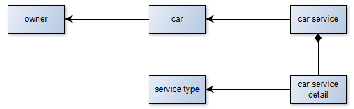

# Car Service API

Example Laravel/Lumen API to manage maintainance services for vehicles.

## Key concepts /ADR

- Onion/Hexagonal architecture: a DDD implementation to keep our business logic apart from our infrastructure.
- Low-dependency approach: to avoid the vendor lock-in antipattern and enhance the migration/upgrade experience.



## Installing

```
composer install
cp .env.example .env
```

## Running

```
docker-compose up
docker-compose exec app php artisan migrate
```

- Navigate to your host, i.e. http://localhost/api/v1/owners/
- Or use the postman collection named `CarService.postman_collection`, available in the root dir of this project. After importing it, plase verify and update the URL/IP defined in the `base_url` variable, if necessary.


## Getting into the containers

```
docker-compose exec app bash
docker-compose exec db bash
```

## Pending

- Car services and service details aggregate / methods.
- All Entity fields should be value objects (remaining strings/integers): this enables domain-based validation.
- Unit & Feature Testing
